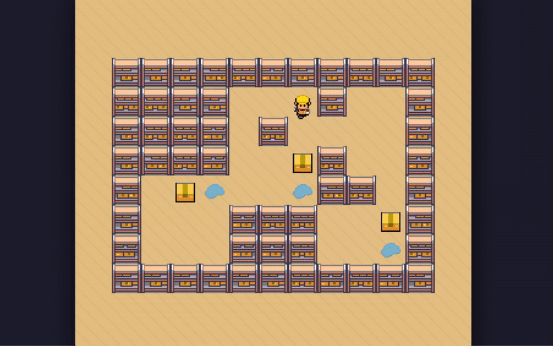

# Soakoban

Sokoban solver developed with [Raylib C#](https://github.com/raylib-cs/raylib-cs)



## Build & run

```console
$ git clone https://github.com/del-Real/Soakoban.git
$ cd Soakoban/src
$ dotnet build
```

Run the program with:

```console
$ cd ../build/bin/net8.0
$ ./sokoban '###########\n####  @#  #\n#### #    #\n####  $#  #\n# $.  .## #\n#   ###  $#\n#   ###  .#\n###########' A\* 100
```


